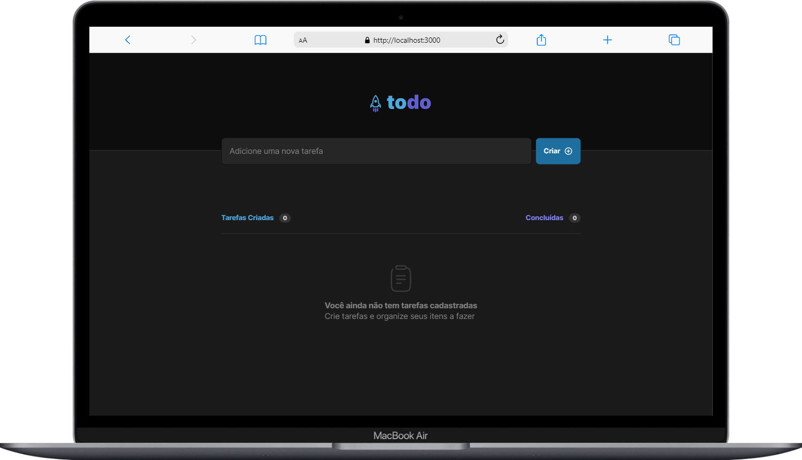
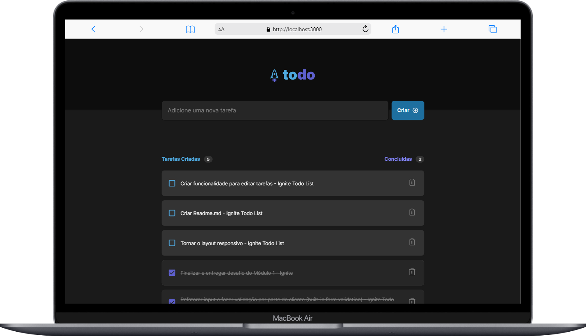

<h1 align="center" style="color: rgba(68, 131, 97, 1);">Desafio: Ignite Todo List</h1>

    Desafio proposto durante o módulo 1 da trilha de ReactJs do bootcamp <a href="https://lp.rocketseat.com.br/ignite?&&" style="color: rgba(68, 131, 97, 1); text-decoration: underline;">Ignite</a>
  

  <a href="#-tecnologias-e-bibliotecas">Tecnologias</a>&nbsp;&nbsp;&nbsp;|&nbsp;&nbsp;&nbsp;
  <a href="#-como-executar">Como executar</a>

  

 

  
  

 

## ✏️ Tecnologias e bibliotecas

Para a construção do projeto, foram utilizadas as seguintes tecnologias:

- [ReactJs](https://pt-br.reactjs.org/)
- [TypeScript](https://www.typescriptlang.org/)
- [Vite](https://vitejs.dev/)
- [uuidv4](https://www.npmjs.com/package/uuidv4)
- [phosphor-react](https://www.npmjs.com/package/phosphor-react)

 

---

## ✨ Sobre o projeto

Desafio proposto para reforçar os conceitos mais importantes do ReactJs. Foi proposto uma aplicação de controle de tarefas, no estilo to-do list, com as seguintes funcionalidades:

- Adicionar tarefa;
- Marcar e desmarcar tarefa como concluída;
- Remover tarefa da lista;
- Mostrar progreço de conclusão de tarefa.

Foram relembrados na aplicação os seguintes conceitos: Estados, Contextos, Tipagem, Imutabilidade, Listas e chaves no React...

### 💄 Layout
Para essa aplicação a equipe da RocketSeat forneceu um layout para ser seguido.

 <a href="https://www.figma.com/file/myovJeEBMZdHlX2KEJaVgI/ToDo-List-(Copy)?node-id=12%3A106" style="color: rgba(68, 131, 97, 1); text-decoration: underline;">Clique aqui</a> e acesse o conteúdo!

 

---

## 📄 Como executar
Para executar o projeto, rode o seguinte código no terminal após clonar o mesmo:

`npm run dev`

 

---